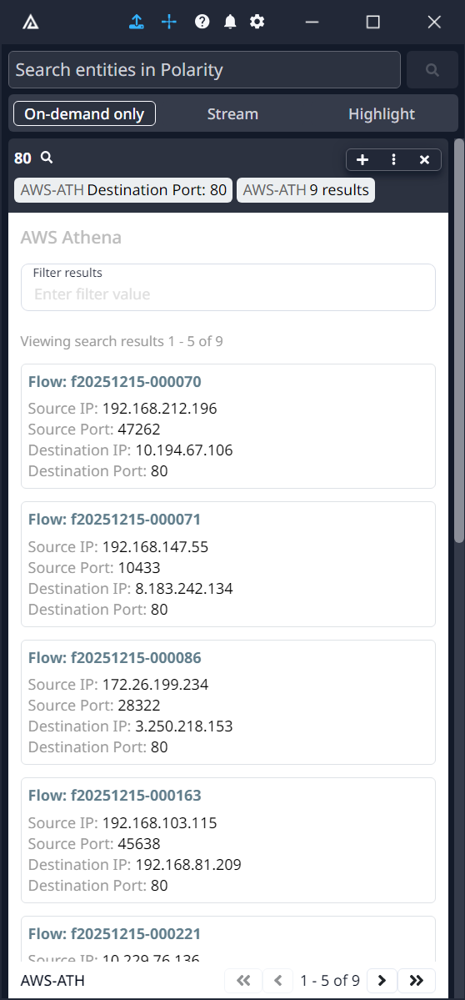

# Polarity AWS Athena Integration

The Polarity AWS Athena integration enables querying of your data stored in Amazon S3 using standard SQL through AWS Athena. This integration allows you to search for entities (IP addresses, domains, hashes, etc.) across your data lake using SQL queries with parameterized or static queries.



## AWS Athena Integration Options

### AWS Region

The AWS Region where your Athena service and S3 data sources are located. The Athena endpoint is based on your selected region. Ensure this matches the region where your data and Athena WorkGroups are configured.

### AWS Access Key Id

The access key ID that identifies the security credentials used to authenticate to AWS Athena. If left blank, credentials will be loaded from AWS IAM using the credentials provider of the Amazon EC2 instance (if configured in the instance metadata).

We recommend using security credentials tied to an IAM service user with the minimum required permissions. See the "Minimum Required IAM Permissions" section below for the exact permissions needed.

### AWS Secret Access Key

The secret access key that can be used to sign requests. If left blank, credentials will be loaded from AWS IAM using the credentials provider of the Amazon EC2 instance (if configured in the instance metadata).

### Athena WorkGroup

The Athena WorkGroup to use for query execution. WorkGroups allow you to organize queries and manage execution settings. If your WorkGroup has a default ResultConfiguration, you may not need to specify an Output Location. Defaults to "primary" if not specified.

### Query Results Output Location

S3 location where Athena should store query results (e.g., "s3://my-bucket/athena-results/"). This is optional if your WorkGroup has a default ResultConfiguration with an OutputLocation already configured.

### SQL Query

The SQL query to execute for each entity searched. Supports both parameterized and non-parameterized queries:

• **Parameterized**: Use `?` as placeholder for entity value. Multiple `?` parameters are supported and will all use the same entity value - Examples:
  - "SELECT * FROM logs WHERE ip = ?"
  - "SELECT * FROM events WHERE (src_ip = ? OR dst_ip = ?)"
• **Non-parameterized**: Static queries without entity substitution - Example: "SELECT COUNT(*) FROM logs WHERE date = CURRENT_DATE"

All `?` parameters will be replaced with the searched entity value.

### Query Result Limit

Set a limit on the number of results returned by the SQL query (defaults to 100). This affects how many rows are retrieved from Athena.

### Summary Attributes

Comma-delimited list of attribute names to include as part of the summary. JSON dot notation can be used to target nested attributes. Attributes must be returned by your SQL query to be displayed. You can change the label to your summary attribute by prepending the label to the attribute path and separating it with a colon (i.e., "<label>:<json path>"). For no label, use a colon with no label (i.e., ":<json path>").

See the section on [Specifying Attributes](#specifying-attributes) for more information on how to use this option.

### Maximum Number of Summary Items

Number of items to show summary tags for. Defaults to 3. If the limit is reached, a total item count will be shown.

### Detail Attributes

Comma-delimited list of attribute names to include as part of the details block. JSON dot notation can be used to target nested attributes. Attributes must be returned by your SQL query to be displayed. You can change the label to your detail attribute by prepending the label to the attribute path and separating it with a colon (i.e., "<label>:<json path>"). If left blank, all fields will be displayed as a JSON document.

See the section on [Specifying Attributes](#specifying-attributes) for more information on how to use this option.

### Item Title Attribute

Name of the attribute to be used as the item title. JSON dot notation can be used to target nested attributes. Attribute must be returned by your SQL query to be displayed. You can change the label to your document attribute by prepending the label to the attribute path and separating it with a colon (i.e., "<label>:<json path>"). For no label, use a colon with no label (i.e., ":<json path>").

See the section on [Specifying Attributes](#specifying-attributes) for more information on how to use this option.

## Specifying Attributes

Attributes to display can be specified via the Summary Attributes and Detail Attributes options. Both options support the same syntax which is a comma delimited list of attribute specifications. An attribute specification at a minimum is the name of the attribute. Nested attributes can be targeted using JSON dot notation when Athena returns nested JSON objects. In addition, a `type` can be specified for the attribute. The `type` currently supports various date formats for converting timestamps and dates returned by Athena into human-readable formats when displayed in the Overlay Window.

Attributes can be specified with the following three forms:

```
<attribute>
<label>:<attribute>
<label>:<type>:<attribute>
```

As an example, suppose we have the following row returned by our SQL query:

```json
{
  "src_ip": "192.168.1.100",
  "dst_ip": "8.8.8.8", 
  "device_info": {
    "hostname": "workstation-01",
    "os": "Windows 11"
  },
  "event_metadata": {
    "severity": "high",
    "classification": "suspicious"
  },
  "ports": [80, 443],
  "created_epoch": 1649724681
}
```

We want our summary tag to display the device hostname with the label "Host". In this example the hostname attribute is nested under the device_info object. We can do that with the following:

```
Host:device_info.hostname
```

This will display the summary tag `Host: workstation-01`. If we also want to include the source IP and event severity in the summary tags we can do the following:

```
src_ip, Host:device_info.hostname, Severity:event_metadata.severity
```

Which will display the summary tags `192.168.1.100`, `Host: workstation-01`, and `Severity: high`.

If we want to display the `created_epoch` attribute and specify that it is a Unix epoch time date in seconds we can do the following:

```
Created:date-seconds:created_epoch
```

If you are specifying a `type` for the attribute then you must also specify a `label`.  The integration supports the following date types:

* date-iso
```
2016
2016-05
201605
2016-05-25
20160525
2016-05-25T09
2016-05-25T09:24
2016-05-25T09:24:15
2016-05-25T09:24:15.123
2016-05-25T0924
2016-05-25T092415
2016-05-25T092415.123
2016-05-25T09:24:15,123
2016-W21-3
2016W213
2016-W21-3T09:24:15.123
2016W213T09:24:15.123
2016-200
2016200
2016-200T09:24:15.123
09:24
09:24:15
09:24:15.123
09:24:15,123
```  

* date-http
```
Sunday, 06-Nov-94 08:49:37 GMT
Sun, 06 Nov 1994 08:49:37 GMT
```

* date-rfc2822 
```
Tue, 01 Nov 2016 13:23:12 +0630
```

* date-sql 
```
2017-05-15
2017-05-15 09:24:15
09:24:15
```

* date-seconds 
```
1542674993
```

* date-millis
```
1542674993410
```


## Minimum Required IAM Permissions

For the integration to function properly, the AWS IAM user must have the following minimum permissions:

### Athena Permissions
```json
{
    "Version": "2012-10-17",
    "Statement": [
        {
            "Effect": "Allow",
            "Action": [
                "athena:GetPreparedStatement",
                "athena:CreatePreparedStatement",
                "athena:UpdatePreparedStatement",
                "athena:StartQueryExecution",
                "athena:GetQueryExecution",
                "athena:GetQueryResults",
                "athena:GetWorkGroup"
            ],
            "Resource": "*"
        }
    ]
}
```

### S3 Permissions for Query Results
```json
{
    "Effect": "Allow",
    "Action": [
        "s3:GetObject",
        "s3:PutObject",
        "s3:GetBucketLocation"
    ],
    "Resource": [
        "arn:aws:s3:::your-athena-results-bucket",
        "arn:aws:s3:::your-athena-results-bucket/*"
    ]
}
```

### S3 Permissions for Data Access
```json
{
    "Effect": "Allow",
    "Action": [
        "s3:GetObject"
    ],
    "Resource": [
        "arn:aws:s3:::your-data-source-bucket/*"
    ]
}
```

### S3 Permissions for Directory Listing
```json
{
    "Effect": "Allow",
    "Action": [
        "s3:ListBucket"
    ],
    "Resource": [
        "arn:aws:s3:::your-data-source-bucket"
    ],
    "Condition": {
        "StringLike": {
            "s3:prefix": [
                "your-data-prefix/*"
            ]
        }
    }
}
```

### AWS Glue Permissions (for Table Metadata)
```json
{
    "Effect": "Allow",
    "Action": [
        "glue:GetDatabase",
        "glue:GetTable", 
        "glue:GetPartition"
    ],
    "Resource": "*"
}
```

**Note:** Replace `your-athena-results-bucket`, `your-data-source-bucket`, and `your-data-prefix` with your actual bucket names and prefixes. If your WorkGroup has a default ResultConfiguration, you may not need the S3 query results permissions.

## Installation Instructions

Installation instructions for integrations are provided on the [PolarityIO GitHub Page](https://polarityio.github.io/).

## Polarity

Polarity is a memory-augmentation platform that improves and accelerates analyst decision making.  For more information about the Polarity platform please see:

https://polarity.io/
